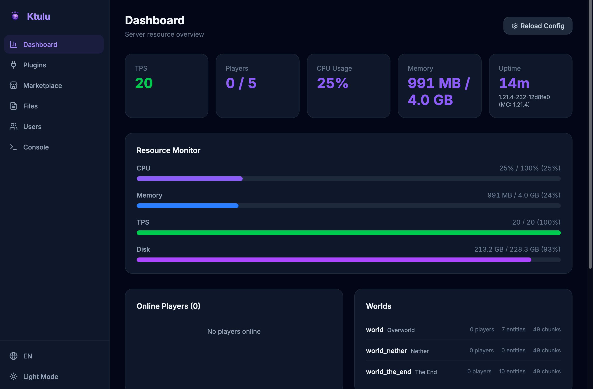
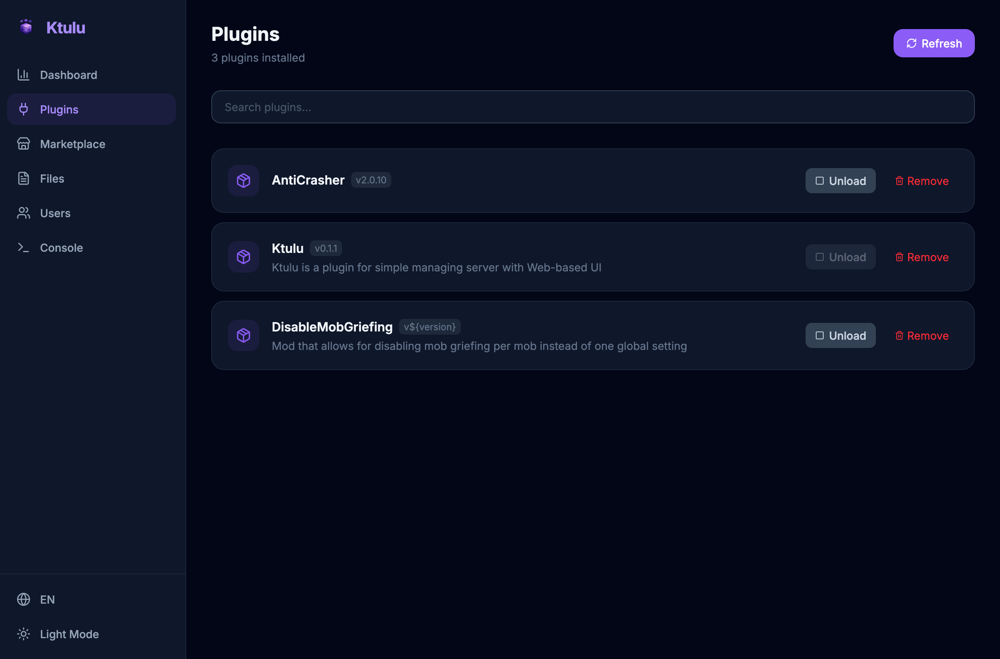
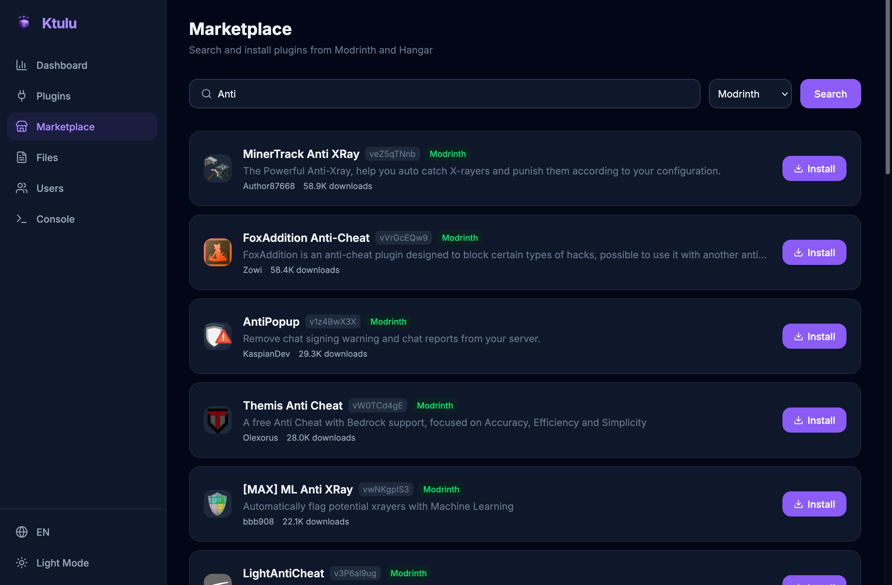
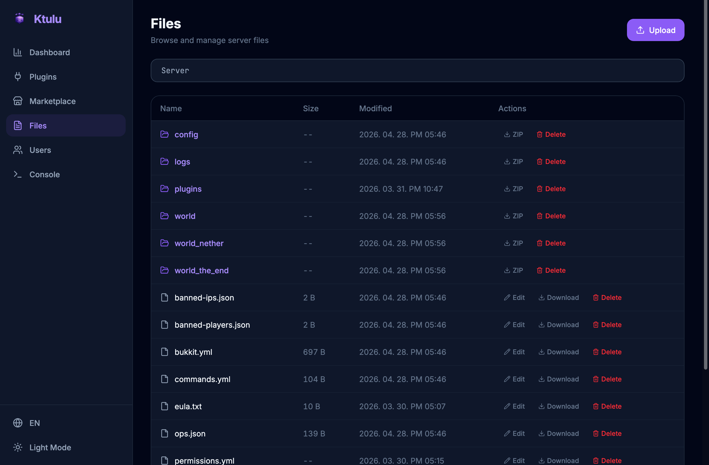
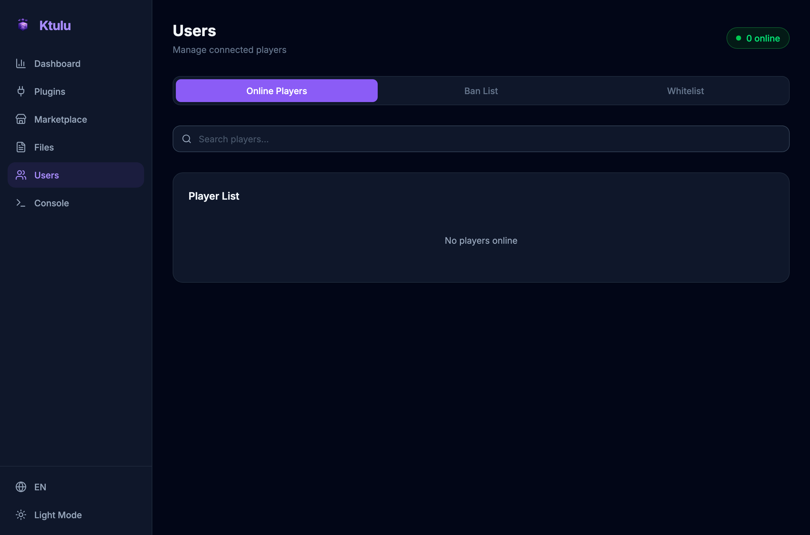
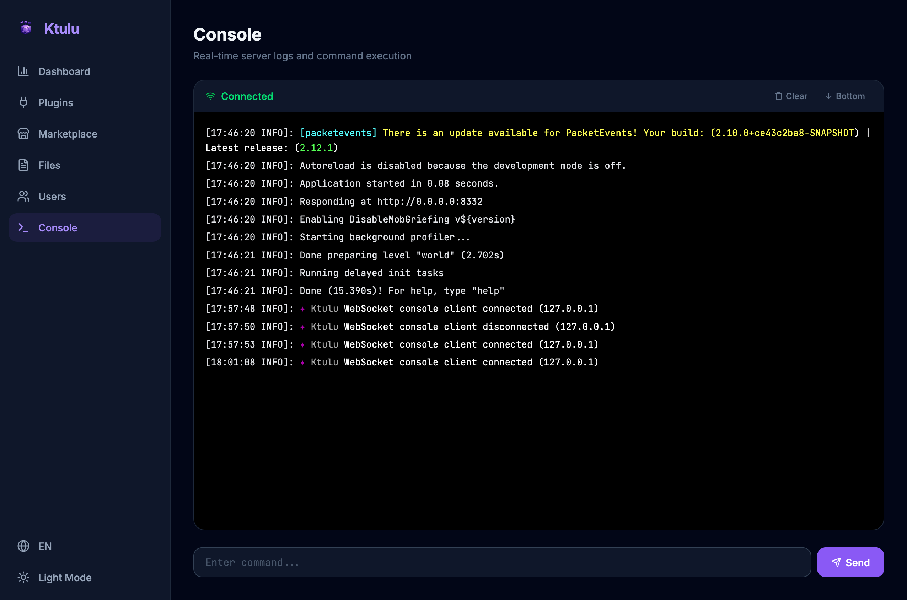

  
  <h1>Ktulu</h1>
  
  
  
  

  Ktulu is a Minecraft Paper plugin for managing your server remotely through a modern Web UI.

## Screenshots

| Dashboard | Plugins | Marketplace |
|:-:|:-:|:-:|
|  |  |  |

| Files | Users | Console |
|:-:|:-:|:-:|
|  |  |  |

## Features

### Dashboard
- Real-time server stats (TPS, CPU, Memory, Disk, Uptime)
- Online player list with avatars and ping
- World info (entities, loaded chunks)
- Quick actions (weather, time, save)
- Recent log viewer

### Plugin Management
- View all installed plugins with status
- Load / Unload plugins at runtime
- Remove plugin files
- Marketplace search & install from Modrinth and Hangar

### File Management
- Browse server directory tree
- Edit text-based config files (yml, json, properties, etc.)
- Upload files to any directory
- Download files and directories (ZIP)
- Delete files and folders with confirmation

### User Management
- Online player list with game mode, coordinates, ping
- Kick / Ban / Unban players
- Op / Deop toggle
- Game mode switching
- Whitelist management (toggle, add, remove)

### Console
- Real-time server log streaming via WebSocket
- ANSI and Minecraft color code rendering
- Execute server commands remotely

### System
- API key authentication
- Rate limiting on auth endpoint
- Dark / Light theme
- i18n support (English, Korean)

## Tech Stack

| Layer | Technology |
|-------|-----------|
| Plugin | Kotlin, Paper API |
| Server | Ktor (Netty), kotlinx.serialization |
| Frontend | SolidJS, TailwindCSS, Vite |

## Progress

- Dashboard
  - [x] Server stats (TPS, CPU, Memory, Disk, Uptime)
  - [x] Online player list
  - [x] World info
  - [x] Quick actions
  - [x] Recent logs
- Plugin Management
  - [x] List installed plugins
  - [x] Load / Unload plugins
  - [x] Remove plugins
  - [x] Marketplace search (Modrinth + Hangar)
  - [x] Marketplace install
- File Management
  - [x] Browse directory tree
  - [x] Edit text files
  - [x] Upload files
  - [x] Download files
  - [x] Download directories as ZIP
  - [x] Delete files / folders
- User Management
  - [x] Online player list
  - [x] Kick / Ban / Unban
  - [x] Op / Deop
  - [x] Game mode switching
  - [x] Whitelist management
- Console
  - [x] Real-time log streaming (WebSocket)
  - [x] Color code rendering (ANSI + Minecraft)
  - [x] Remote command execution
- System
  - [x] API key authentication
  - [x] Rate limiting
  - [x] Dark / Light theme
  - [x] i18n (EN / KO)
  - [ ] Server backups
  - [ ] Scheduled tasks
